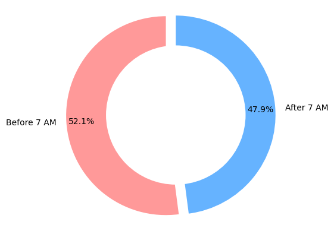
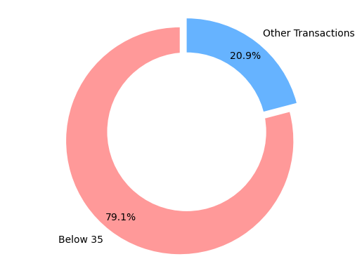
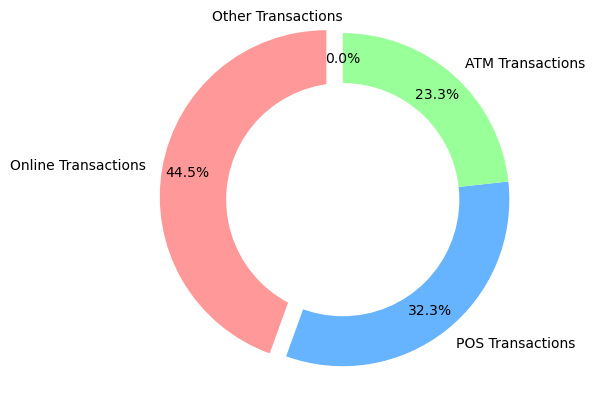
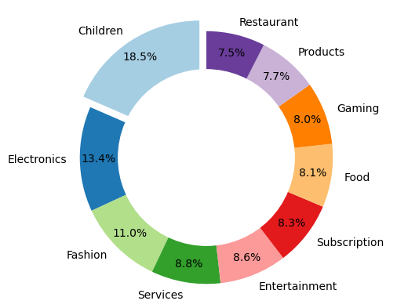

# Credit Card Fraud Pattern Analysis: Uncovering High-Risk Transaction Behaviors

## Executive Summary

**Objective**  
This analysis examines transaction patterns in credit card fraud to help financial institutions identify high-risk behaviors and implement targeted prevention strategies before losses occur.

**Approach**  
The study analyzed over 99,000 historical credit card transactions, comparing fraudulent and legitimate activities across multiple dimensions: transaction timing, amounts, channels (online/POS/ATM), merchant categories, geographic patterns, and customer demographics. Machine learning techniques were applied to identify the most predictive fraud indicators.

**Key Finding**  
The analysis reveals that fraudsters predominantly target **small-value online transactions (≤ £35) during early morning hours (midnight–7 a.m.)**. Specifically, **52% of fraudulent transactions occur before or at 7 a.m.**, while **79% involve amounts below £35**.

**Business Value**  
These findings enable financial institutions to implement precision-targeted fraud controls on high-risk transaction segments while minimizing disruption to legitimate customers. The identified patterns provide a foundation for both rule-based detection systems and advanced fraud modeling.

---

## Business Context

Every year, card issuers lose significant revenue to fraudulent transactions while also absorbing operational costs from chargebacks, investigations, and customer support. Excessive false positives, however, can frustrate genuine customers and drive them to competitors.

Financial institutions face mounting pressure to balance fraud prevention with customer experience. This analysis addresses three critical business needs:

- **Minimize fraud losses** while maintaining operational efficiency
- **Reduce false positives** that frustrate legitimate customers  
- **Develop data-driven fraud prevention strategies** based on actual transaction patterns

The dataset encompasses **100,000 transactions** with comprehensive fraud indicators and attributes including transaction timing, amounts, channels, merchant categories, geographic data, and customer demographics.

---

## Methodology

The analysis followed a systematic approach to uncover fraud patterns:

**Data Preparation**  
Transaction data underwent comprehensive cleaning including missing value treatment, currency standardization, and temporal field engineering to enable pattern analysis.

**Pattern Discovery**  
Fraudulent and legitimate transactions were systematically compared across key dimensions:
- Transaction timing patterns
- Amount distributions and thresholds  
- Channel preferences (online, point-of-sale, ATM)
- Merchant category concentrations
- Geographic transaction patterns
- Customer demographic correlations

**Predictive Modeling**  
A Random Forest classifier was developed to quantify the relative importance of different fraud indicators, providing data-driven validation of observed patterns.

Technical implementation details and code are available in the accompanying Jupyter notebook (`test.ipynb`).

---

## Key Findings

### 1. Temporal Fraud Concentration

The analysis reveals a striking temporal pattern in fraudulent activity:
- **52% of fraudulent transactions occur during early morning hours** (midnight–7 a.m.)
- This represents a dramatic over-concentration, as only **3.7% of legitimate transactions** occur during this period
- Machine learning analysis confirms transaction timing as a primary fraud predictor

**Implication:** Early morning hours represent a critical high-risk window requiring enhanced monitoring protocols.

### 2. Low-Value Transaction Targeting

Contrary to common assumptions about high-value fraud, the data shows:
- **79% of fraudulent transactions involve amounts ≤ £35**
- Fraudsters systematically target smaller amounts, likely to evade detection thresholds
- This pattern persists across all transaction channels

**Implication:** Traditional high-value transaction monitoring misses the majority of fraudulent activity occurring in small-amount segments.

### 3. Channel-Specific Risk Profiles

Online transactions demonstrate elevated fraud risk:
- **Online channels account for 44% of fraudulent activity**
- **Point-of-sale transactions represent 32%**
- **ATM transactions comprise 23%**
- The online channel shows disproportionate fraud concentration relative to transaction volume

**Implication:** Card-not-present transactions require enhanced authentication mechanisms, particularly for small-value, off-hours activity.

### 4. Merchant Category Vulnerabilities

Specific merchant segments show heightened fraud exposure:
- **Children's products merchants: 18% of online fraud**
- **Electronics retailers: 14% of online fraud**  
- **Fashion merchants: 13% of online fraud**

**Implication:** These merchant categories warrant specialized risk assessment and monitoring protocols.

### 5. Geographic and Institutional Patterns

Cross-border transaction analysis reveals:
- Fraudulent activity spans multiple countries (**India, USA, China, Russia, UK**)
- **98% of cardholders are UK residents**, indicating targeted victimization of UK customers
- Certain issuing institutions show elevated fraud exposure rates

**Implication:** Geographic inconsistencies and institutional risk profiles provide additional fraud detection signals.

---

## Supporting Visualizations

The following charts illustrate the key fraud patterns identified in the analysis:

### Temporal Distribution of Fraud

*Fraudulent transactions show heavy concentration during early morning hours, with over half occurring before 7 a.m.*

### Transaction Amount Analysis  

*The majority of fraudulent activity targets low-value transactions under £35, challenging traditional high-value monitoring approaches.*

### Channel Risk Assessment

*Online transactions demonstrate the highest fraud concentration, followed by point-of-sale and ATM channels.*

### Merchant Category Exposure

*Certain merchant categories show disproportionate fraud exposure, particularly children's products, electronics, and fashion retailers.*

---

## Strategic Recommendations

The analysis supports several targeted fraud prevention strategies:

### 1. Temporal and Amount-Based Controls
Financial institutions should implement enhanced monitoring for:
- **Early morning transactions** (midnight–7 a.m.) combined with **low amounts** (≤ £35)
- **Online channel transactions** during high-risk time windows
- Automated flagging systems that trigger additional authentication for these risk combinations

### 2. Channel-Specific Authentication Enhancement  
Online transaction security should be strengthened through:
- **Multi-factor authentication** for high-risk merchant categories
- **Device fingerprinting** and behavioral analysis for card-not-present transactions
- **Geographic consistency checks** comparing transaction location to cardholder patterns

### 3. Merchant Category Risk Management
Specialized monitoring protocols for elevated-risk segments:
- **Enhanced due diligence** for children's products, electronics, and fashion merchants
- **Dynamic transaction limits** based on merchant category risk profiles
- **Real-time merchant risk scoring** integration

### 4. Predictive Model Development
The identified patterns provide a foundation for:
- **Feature engineering** incorporating temporal, amount, channel, and merchant variables
- **Risk scoring algorithms** that weight multiple fraud indicators
- **Continuous model validation** against emerging fraud patterns

---

## Implementation Roadmap

This analysis establishes the foundation for enhanced fraud prevention capabilities. Future development priorities include:

### Model Enhancement
- **Class imbalance optimization** through advanced sampling techniques and cost-sensitive learning approaches
- **Feature engineering refinement** to capture complex categorical relationships without excessive dimensionality
- **Algorithm comparison** across multiple machine learning approaches to identify optimal performance

### System Integration  
- **Production model deployment** incorporating the identified risk factors
- **Real-time scoring infrastructure** for transaction-level fraud assessment
- **Performance monitoring** and model drift detection capabilities

### Validation Framework
- **A/B testing protocols** to measure fraud reduction and customer impact
- **Backtesting procedures** for rule effectiveness evaluation  
- **Continuous improvement** processes based on emerging fraud patterns

*Technical implementation details and analytical code are documented in the accompanying Jupyter notebook. This report focuses on business insights and strategic recommendations for stakeholder review.*
